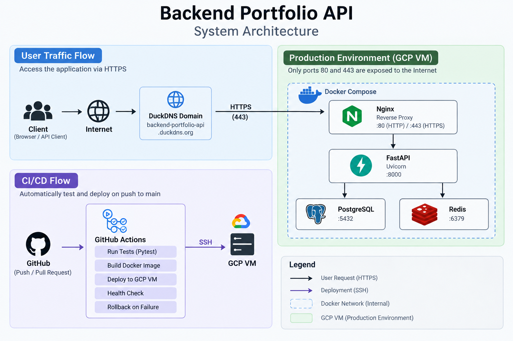

# Backend Portfolio API

以 **FastAPI** 開發的 RESTful API 後端作品，實作使用者、商品與訂單管理，包含 JWT 身分驗證、角色權限控制、庫存管理、PostgreSQL、Redis 快取與自動化測試。

專案使用 Docker Compose 建立完整服務環境，正式部署於 **Google Cloud Compute Engine VM**，透過 Nginx 提供 Reverse Proxy 與 HTTPS，並使用 GitHub Actions 建立 CI/CD 自動測試、部署與失敗回滾流程。

## Live Demo

- API: https://backend-portfolio-api.duckdns.org
- Swagger UI: https://backend-portfolio-api.duckdns.org/docs
- Health Check: https://backend-portfolio-api.duckdns.org/health

---

## Features

### Authentication & Authorization

- 使用者註冊與登入
- Argon2 密碼雜湊
- JWT Access Token
- User / Admin Role-Based Access Control（RBAC）
- 使用者停權管理

### Product Management

- 商品 CRUD
- 商品條件篩選、排序與 Pagination
- Admin-only 商品管理

### Order & Inventory

- 訂單 CRUD
- 一般使用者僅能操作自己的訂單
- Admin 可查看所有訂單
- 建立訂單時檢查並扣除庫存
- 修改訂單時同步調整庫存
- 刪除訂單時自動回補庫存

### Cache

- Redis Cache-Aside 商品快取
- TTL 與 Cache Invalidation
- Redis 異常時回退至 Database 查詢

---

## Tech Stack

| Category | Technologies |
|---|---|
| Backend | Python 3.12, FastAPI, Uvicorn, Pydantic |
| ORM / Database | SQLAlchemy, PostgreSQL 17, Alembic |
| Authentication | OAuth2, JWT, Argon2 |
| Cache | Redis 7 |
| Testing | Pytest |
| Infrastructure | Docker, Docker Compose, Nginx |
| Deployment | Google Cloud Compute Engine, Let's Encrypt |
| CI/CD | GitHub Actions |

---

## System Architecture



正式環境僅公開 Nginx 的 `80/443`，FastAPI、PostgreSQL 與 Redis 透過 Docker Network 進行內部通訊。

HTTP Request 會由 Nginx Redirect 至 HTTPS，TLS 憑證使用 Let's Encrypt / Certbot 管理。

---

## API Overview

| Resource | Main Endpoints | Permission |
|---|---|---|
| Users | Register / Login | Public |
| Products | GET | Public |
| Products | POST / PUT / DELETE | Admin |
| Orders | CRUD | User / Admin |
| Admin Users | Role / Status Management | Admin |

完整 API Request / Response 格式可透過 [Swagger UI](https://backend-portfolio-api.duckdns.org/docs) 查看。

---

## CI/CD

GitHub Actions 負責自動測試與正式環境部署。

```text
Push / Pull Request
        |
        v
      CI
        |
     Pytest
        |
        | main CI passed
        v
      CD
        |
        v
   SSH to GCP VM
        |
        v
 Checkout Target Commit
        |
        v
Validate Nginx Config
        |
        v
Build Versioned Image
        |
        v
Alembic Migration
        |
        v
Deploy FastAPI
        |
        v
Docker Health Check
      /       \
 success     failure
    |           |
    v           v
Update Web    Rollback
```

API Docker Image 使用 **Git commit SHA** 作為版本 Tag。部署後會執行 Container Health Check；若新版 API 無法正常啟動，部署流程會嘗試回滾至上一個可用 Image。

---

## Testing

使用 Pytest 測試 API、Authentication、Authorization、訂單與庫存邏輯。

```bash
python -m pytest
```

目前測試結果：

```text
37 passed
```

CI 在 Push / Pull Request 時也會自動執行測試。

---

## Project Structure

```text
backend-portfolio/
├── routers/             # API Routes
├── models/              # SQLAlchemy Models
├── schemas/             # Pydantic Schemas
├── tests/               # Pytest
├── alembic/             # Database Migrations
├── nginx/               # Dev / Production Nginx Config
├── .github/workflows/   # CI/CD
├── main.py
├── database.py
├── security.py
├── cache.py
├── compose.yaml
├── compose.dev.yaml
├── compose.prod.yaml
└── dockerfile
```

---

## Local Development

參考 `.env.example` 建立 `.env.dev` 後：

```bash
docker compose --env-file .env.dev \
  -f compose.yaml \
  -f compose.dev.yaml \
  up -d --build
```

啟動後：

- Swagger UI: http://localhost/docs
- Health Check: http://localhost/health

---

## Deployment

Production 部署於 **Google Cloud Compute Engine VM**。

正式環境由 Docker Compose 管理：

```text
Docker Compose
├── Nginx
├── FastAPI
├── PostgreSQL
└── Redis
```

搭配 Nginx Reverse Proxy、HTTPS、Container Health Check、Restart Policy、Log Rotation 與 GitHub Actions CI/CD。
