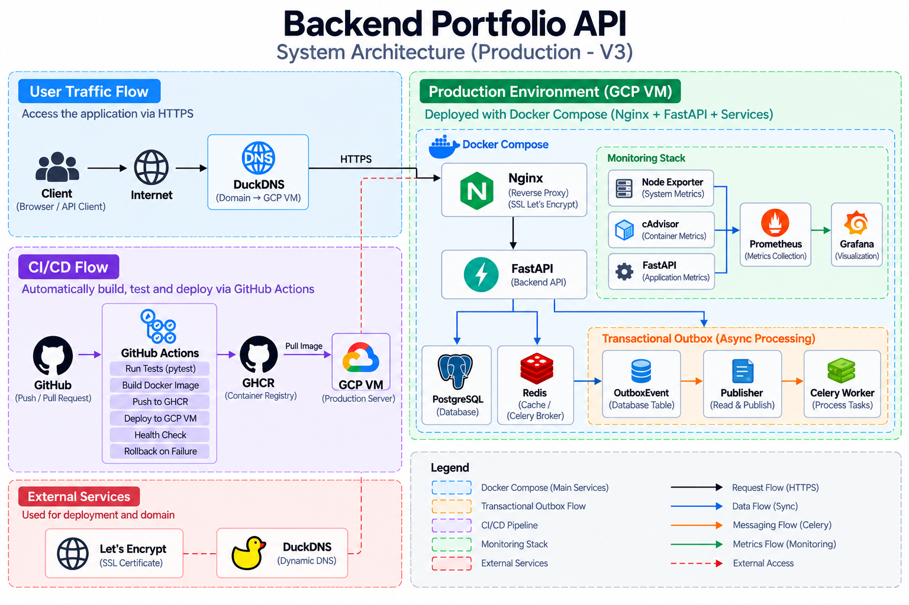

# Backend Portfolio

以 **FastAPI** 開發並實際部署的 RESTful API 後端作品，涵蓋使用者、商品與訂單管理，並整合 **JWT / RBAC、PostgreSQL、Redis、並發庫存控制、Transactional Outbox、Celery、Monitoring 與 CI/CD**。

Production 部署於 **Google Cloud Compute Engine**，由 Docker Compose 管理，Nginx 提供 Reverse Proxy 與 HTTPS；GitHub Actions 負責自動測試、建立版本化 Docker Image 並推送到 GHCR，並部署至 VM。

## Live Demo

- API: https://backend-portfolio-api.duckdns.org
- Swagger UI: https://backend-portfolio-api.duckdns.org/docs
- Health Check: https://backend-portfolio-api.duckdns.org/health

## Key Features

### Authentication & Authorization

- 使用者註冊 / 登入
- Argon2 密碼雜湊
- OAuth2 + JWT Access Token
- User / Admin RBAC
- 使用者停權管理
- Redis Login Rate Limit（60 秒 10 次）
- Redis 異常時採 Fail Open

### Product & Cache

- 商品 CRUD、篩選、排序與 Pagination
- Admin-only 商品管理
- Redis Cache-Aside
- TTL / Cache Invalidation
- Redis 異常時回退 Database

### Order & Concurrency

- 訂單 CRUD 與使用者資料隔離
- Admin 可管理所有訂單
- 建立 / 修改 / 刪除訂單時同步維護庫存
- PostgreSQL `SELECT ... FOR UPDATE` Row-Level Lock
- Transaction Commit / Rollback
- 並發測試驗證庫存僅剩 1 時，兩個同時下單請求只有一個成功

### Background Processing

- Transactional Outbox Pattern
- Order、Stock、Outbox Event 於同一 Database Transaction 處理
- Publisher 發送待處理事件
- Redis 作為 Celery Broker
- Celery Worker 執行背景任務
- 成功後將 Outbox Event 更新為 `sent`

### Observability

- UUID Request ID + `ContextVar`
- `X-Request-ID` Response Header
- Request ID 可傳遞至 Outbox / Worker Log
- FastAPI `/metrics`
- Prometheus + Grafana
- Node Exporter + cAdvisor

## Tech Stack

| Category | Technologies |
|---|---|
| Backend | Python 3.12, FastAPI, Uvicorn, Pydantic |
| Database | PostgreSQL 17, SQLAlchemy, Alembic |
| Authentication | OAuth2, JWT, Argon2 |
| Cache / Broker | Redis 7 |
| Background Processing | Celery, Transactional Outbox |
| Testing | Pytest, AnyIO, HTTPX |
| Infrastructure | Docker, Docker Compose, Nginx |
| Monitoring | Prometheus, Grafana, Node Exporter, cAdvisor |
| Deployment | Google Cloud Compute Engine, Let's Encrypt |
| CI/CD | GitHub Actions, GHCR |

## System Architecture



```text
                         Internet
                            |
                         HTTPS
                            |
                          Nginx
                            |
                         FastAPI
                       /         \
                      v           v
               PostgreSQL       Redis
                    |            /   \
                    v           v     v
              OutboxEvent     Cache  Celery Broker
                    |                  |
                Publisher              v
                    └──────────────> Worker

FastAPI /metrics ─┐
Node Exporter ────┼──> Prometheus ───> Grafana
cAdvisor ─────────┘
```

Production 對外入口由 Nginx 提供；FastAPI、PostgreSQL、Redis、Worker、Publisher 與 Monitoring Services 透過 Docker Network 內部通訊。

## API Overview

| Resource | Main Endpoints | Permission |
|---|---|---|
| Users | Register / Login | Public |
| Products | GET | Public |
| Products | Create / Update / Delete / Stock | Admin |
| Orders | CRUD | User / Admin |
| Admin Users | List / Role / Status | Admin |

完整 Request / Response 格式請參考 Swagger UI。

## Concurrency & Transaction Safety

訂單建立與修改涉及庫存，因此透過 PostgreSQL Row-Level Lock 鎖定 Product：

```python
select(Product).where(Product.id == product_id).with_for_update()
```

並發測試情境：

```text
Initial Stock = 1

Request A ─┐
           ├── Concurrent Create Order
Request B ─┘

Result:
1 request  -> 201 Created
1 request  -> 400 Bad Request
stock      -> 0
orders     -> 1
```

藉此驗證同一商品在並發請求下不會發生超賣。

## Transactional Outbox

建立訂單時，核心資料與事件在同一 Transaction 中寫入：

```text
POST /orders
     |
     v
Database Transaction
     |
     +--> Create Order
     +--> Update Stock
     +--> Create OutboxEvent
     |
   Commit
     |
     v
 Publisher
     |
     v
Redis / Celery
     |
     v
   Worker
```

Production End-to-End 驗證已確認 `order_created` 事件可由 Publisher 發送至 Celery Worker 並成功處理，同一個 `request_id` 也可一路追蹤至 Worker。

## Monitoring

FastAPI 使用 `prometheus-fastapi-instrumentator` 取得 `/metrics`，Prometheus 每 15 秒 Scrape：

- FastAPI
- Node Exporter
- cAdvisor

目前可觀察 HTTP Request Count、Status、Request Duration、Host Metrics 與 Container Metrics。

Production 驗證時三個 Prometheus Targets 均為 `UP`，Grafana Health Check 亦正常。

## Testing

```bash
python -m pytest
```

目前：


測試涵蓋 Authentication、RBAC、Products、Orders、Inventory 與 Concurrent Order Creation；Push / Pull Request 時 CI 也會自動執行測試。

## CI/CD

```text
Push / Pull Request
        |
        v
       CI
        |
        +--> Pytest
        +--> Docker Build Validation
        |
        | main CI passed
        v
       CD
        |
        +--> Checkout DEPLOY_SHA
        +--> Build API Image
        +--> Tag with Git Commit SHA
        +--> Push to GHCR
        |
        v
   SSH to GCP VM
        |
        +--> Pull GHCR Image
        +--> Reset Repository to DEPLOY_SHA
        +--> Start PostgreSQL + Redis
        +--> Alembic Migration
        +--> Start / Health Check FastAPI
        +--> Start Worker + Publisher + Nginx
        +--> Start Monitoring Services
        |
        v
 Production Validation
        |
        +--> API / Worker / Publisher
        +--> Nginx Config + HTTPS
        +--> Prometheus Config / Targets
        +--> Grafana Health    
     /    \
 success  failure
    |        |
   Done   Rollback
```

Production VM **不負責 Build API Image**。GitHub Actions 建立 Image 後推送至 GHCR，VM 依 Git commit SHA Pull 對應版本：

```text
ghcr.io/<owner>/backend-portfolio-api:<DEPLOY_SHA>
```

部署採 Staged Startup；核心服務與 API 通過health check 後才逐步啟動其餘服務。部署失敗時則嘗試rollback至上一個可用版本。

## Production Infrastructure

Docker Compose 管理：

```text
Docker Compose
├── Nginx
├── FastAPI
├── PostgreSQL
├── Redis
├── Celery Worker
├── Outbox Publisher
├── Prometheus
├── Grafana
├── Node Exporter
└── cAdvisor
```

Production 另包含：

- Nginx Reverse Proxy + HTTPS / Let's Encrypt
- Container Health Check
- `restart: unless-stopped`
- Log Rotation
- Versioned GHCR Image
- Deployment Health Validation / Rollback
- Google Cloud VM Instance Schedule
- Persistent Disk Snapshot Schedule

所有長時間執行的服務均設定 `restart: unless-stopped`。實際 VM Stop → Start 測試已確認 Containers 能由 Docker 自動恢復並回到 Health 狀態。

## Project Structure

```text
backend-portfolio/
├── .github/
│   └── workflows/
│       ├── ci.yml
│       └── cd.yml
├── alembic/
│   └── versions/               # Database Migrations
├── assets/
│   └── system-architecture.png
├── models/                     # SQLAlchemy Models
│   ├── user.py
│   ├── product.py
│   ├── order.py
│   ├── outboxevent.py
│   └── processedevent.py
├── nginx/
│   ├── default.conf
│   └── default.prod.conf
├── routers/                    # FastAPI Routers
│   ├── users.py
│   ├── products.py
│   ├── orders.py
│   └── admin.py
├── schemas/                    # Pydantic Schemas
│   ├── user.py
│   ├── product.py
│   └── order.py
├── scripts/
│   └── check_monitoring.py
├── tests/
│   ├── conftest.py
│   ├── test_users.py
│   ├── test_products.py
│   └── test_orders.py
├── main.py
├── database.py
├── security.py
├── cache.py
├── redis_client.py
├── celery_app.py
├── outbox_publisher.py
├── context_var.py
├── logging_config.py
├── sentry_config.py
├── prometheus.yml
├── compose.yaml
├── compose.dev.yaml
├── compose.prod.yaml
├── dockerfile
├── requirements.txt
├── requirements.dev.txt
└── README.md
```

## Local Development

參考 `.env.example` 建立 `.env.dev`：

```bash
docker compose --env-file .env.dev \
  -f compose.yaml \
  -f compose.dev.yaml \
  up -d --build
```

啟動後：

- Swagger UI: http://localhost/docs
- Health Check: http://localhost/health

## V3 Production Validation

V3 完成後已實際驗證：

```text
HTTPS / Nginx                  PASS
FastAPI Health Check           PASS
Login / JWT                    PASS
User / Admin RBAC              PASS
PostgreSQL                     PASS
Product / Order Flow           PASS
Stock Deduction                PASS
Outbox → Publisher → Worker    PASS
Request ID Propagation         PASS
Prometheus Targets / Metrics   PASS
Grafana Health                 PASS
VM Stop / Start Recovery       PASS
CI/CD Production Deployment    PASS
```

V3 的核心目標是將 API、Database、Cache、Concurrency Control、Background Processing、Observability 與 CI/CD 整合成一套可實際部署、監控與驗證的後端系統。
